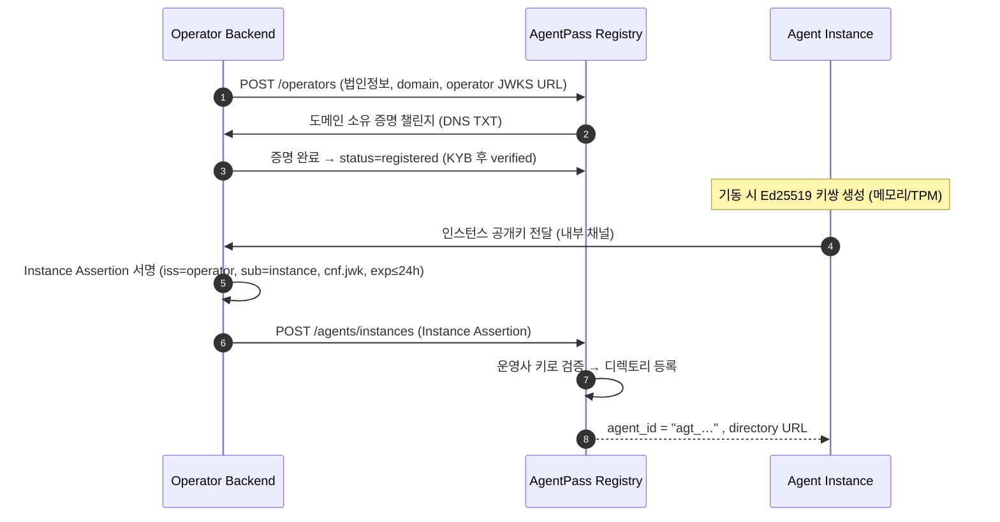
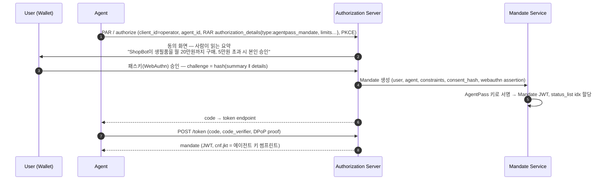
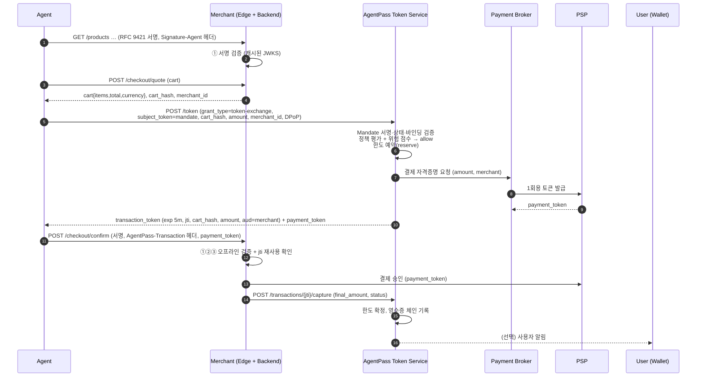
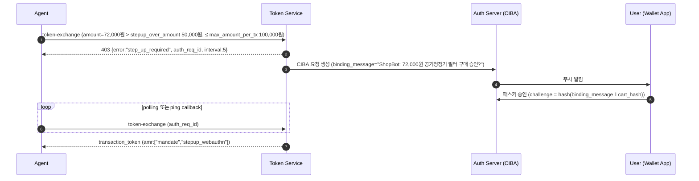
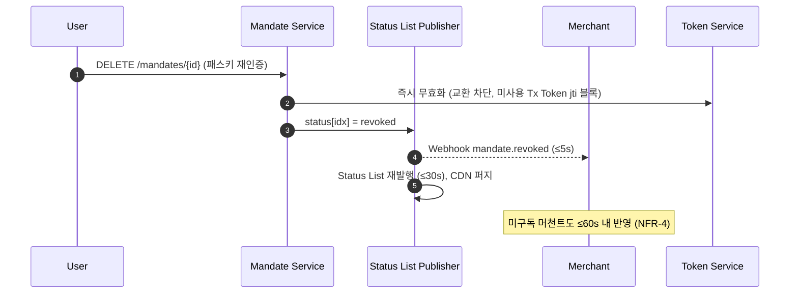
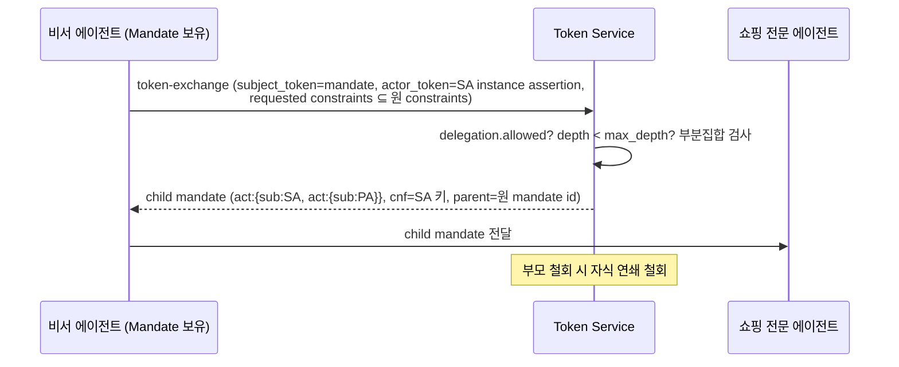

# 시퀀스 다이어그램

## S1. 에이전트 운영사 등록 & 인스턴스 기동 (UC-1, UC-2)

```mermaid
sequenceDiagram
  autonumber
  participant OP as Operator Backend
  participant REG as AgentPass Registry
  participant AG as Agent Instance
  OP->>REG: POST /operators (법인정보, domain, operator JWKS URL)
  REG->>OP: 도메인 소유 증명 챌린지 (DNS TXT)
  OP->>REG: 증명 완료 → status=registered (KYB 후 verified)
  Note over AG: 기동 시 Ed25519 키쌍 생성 (메모리/TPM)
  AG->>OP: 인스턴스 공개키 전달 (내부 채널)
  OP->>OP: Instance Assertion 서명 (iss=operator, sub=instance, cnf.jwk, exp≤24h)
  OP->>REG: POST /agents/instances (Instance Assertion)
  REG->>REG: 운영사 키로 검증 → 디렉토리 등록
  REG-->>AG: agent_id = "agt_…" , directory URL
```

## S2. Mandate 발급 (UC-3)

```mermaid
sequenceDiagram
  autonumber
  participant U as User (Wallet)
  participant AG as Agent
  participant AS as Authorization Server
  participant MS as Mandate Service
  AG->>AS: PAR / authorize (client_id=operator, agent_id, RAR authorization_details{type:agentpass_mandate, limits…}, PKCE)
  AS->>U: 동의 화면 — 사람이 읽는 요약<br/>"ShopBot이 생필품을 월 20만원까지 구매, 5만원 초과 시 본인 승인"
  U->>AS: 패스키(WebAuthn) 승인 — challenge = hash(summary ‖ details)
  AS->>MS: Mandate 생성 (user, agent, constraints, consent_hash, webauthn assertion)
  MS->>MS: AgentPass 키로 서명 → Mandate JWT, status_list idx 할당
  AS-->>AG: code → token endpoint
  AG->>AS: POST /token (code, code_verifier, DPoP proof)
  AS-->>AG: mandate (JWT, cnf.jkt = 에이전트 키 썸프린트)
```

## S3. 자동 구매 — 사용자 부재, 범위 내 (UC-5)

```mermaid
sequenceDiagram
  autonumber
  participant AG as Agent
  participant M as Merchant (Edge + Backend)
  participant TS as AgentPass Token Service
  participant PCB as Payment Broker
  participant PSP as PSP
  participant U as User (Wallet)
  AG->>M: GET /products … (RFC 9421 서명, Signature-Agent 헤더)
  M->>M: ① 서명 검증 (캐시된 JWKS)
  AG->>M: POST /checkout/quote (cart)
  M-->>AG: cart{items,total,currency}, cart_hash, merchant_id
  AG->>TS: POST /token (grant_type=token-exchange,<br/>subject_token=mandate, cart_hash, amount, merchant_id, DPoP)
  TS->>TS: Mandate 서명·상태·바인딩 검증<br/>정책 평가 + 위험 점수 → allow<br/>한도 예약(reserve)
  TS->>PCB: 결제 자격증명 요청 (amount, merchant)
  PCB->>PSP: 1회용 토큰 발급
  PSP-->>PCB: payment_token
  TS-->>AG: transaction_token (exp 5m, jti, cart_hash, amount, aud=merchant) + payment_token
  AG->>M: POST /checkout/confirm (서명, AgentPass-Transaction 헤더, payment_token)
  M->>M: ①②③ 오프라인 검증 + jti 재사용 확인
  M->>PSP: 결제 승인 (payment_token)
  M->>TS: POST /transactions/{jti}/capture (final_amount, status)
  TS->>TS: 한도 확정, 영수증 체인 기록
  TS-->>U: (선택) 사용자 알림
```

## S4. Step-up — 한도 초과 (UC-6)

```mermaid
sequenceDiagram
  autonumber
  participant AG as Agent
  participant TS as Token Service
  participant AS as Auth Server (CIBA)
  participant U as User (Wallet App)
  AG->>TS: token-exchange (amount=72,000원 > stepup_over_amount 50,000원, ≤ max_amount_per_tx 100,000원)
  TS-->>AG: 403 {error:"step_up_required", auth_req_id, interval:5}
  TS->>AS: CIBA 요청 생성 (binding_message="ShopBot: 72,000원 공기청정기 필터 구매 승인?")
  AS->>U: 푸시 알림
  U->>AS: 패스키 승인 (challenge = hash(binding_message ‖ cart_hash))
  loop polling 또는 ping callback
    AG->>TS: token-exchange (auth_req_id)
  end
  TS-->>AG: transaction_token (amr:["mandate","stepup_webauthn"])
```

## S5. 철회 (UC-7)

```mermaid
sequenceDiagram
  autonumber
  participant U as User
  participant MS as Mandate Service
  participant STS as Status List Publisher
  participant M as Merchant
  participant TS as Token Service
  U->>MS: DELETE /mandates/{id} (패스키 재인증)
  MS->>TS: 즉시 무효화 (교환 차단, 미사용 Tx Token jti 블록)
  MS->>STS: status[idx] = revoked
  STS-->>M: Webhook mandate.revoked (≤5s)
  STS->>STS: Status List 재발행 (≤30s), CDN 퍼지
  Note over M: 미구독 머천트도 ≤60s 내 반영 (NFR-4)
```

## S6. 재위임 (UC-10)

```mermaid
sequenceDiagram
  participant PA as 비서 에이전트 (Mandate 보유)
  participant TS as Token Service
  participant SA as 쇼핑 전문 에이전트
  PA->>TS: token-exchange (subject_token=mandate, actor_token=SA instance assertion,<br/>requested constraints ⊆ 원 constraints)
  TS->>TS: delegation.allowed? depth < max_depth? 부분집합 검사
  TS-->>PA: child mandate (act:{sub:SA, act:{sub:PA}}, cnf=SA 키, parent=원 mandate id)
  PA->>SA: child mandate 전달
  Note over TS: 부모 철회 시 자식 연쇄 철회
```
